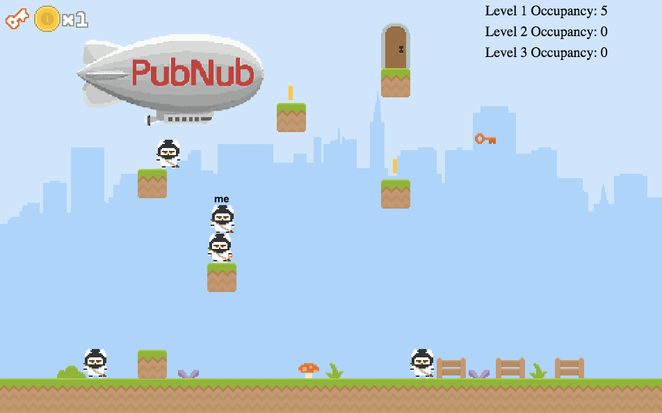

# Ninja Multiplayer Platformer Game in Real Time #

## Play Now: https://pubnubdevelopers.github.io/Ninja-Multiplayer-Platformer/

```
npm install pubnubninja
```



A step by step tutorial of how to create this multiplayer game is available here: 

https://www.pubnub.com/tutorials/javascript/multiplayer-game/

## Table of Contents
* [Synopsis](#synopsis)
* [Introduction to Phaser](#phaser)
* [Introduction to PubNub](#pubnub)
* [Getting Started](#getting-started)
* [Code Layout](#code-layout)
* [Main.js](#main.js)
* [loadingState.js](#loadingState.js)
* [heroScript.js](#hero-script)
* [blockscode.js](#blockscode)
* [Credits](#credits)

## <a name="synopsis"></a>Synopsis
Creating a real time multiplayer game can be a daunting task to take on alone.  When I stumbled upon Mozilla’s game development <a href="https://hacks.mozilla.org/2017/04/html5-games-workshop-make-a-platformer-game-with-javascript/?utm_source=gamedevjsweekly&utm_medium=email">workshop</a>, I decided to take on the challenge to turn Belén Albeza's workshop into a real time game.  This Ninja Platformer Multiplayer Game uses PubNub’s real time data stream network to manage network traffic between players, and also uses PubNub Blocks to manage game state between devices.  PubNub made the development process incredibly simple and allowed the entire demo to be written in less than a <b>1000 lines of code!!!</b>  This feat is incredible for the amount of functionality this game has and is an excellent showcase of both Phaser and PubNub’s capabilities.  

This Ninja Platformer Multiplayer Game is written in javascript and the levels are generated via JSON files with information on the position of the platforms and game objects.

This real time multiplayer game is a collaborative puzzle game that encourages you to work with your friends to collect the keys in clever ways.  Using Phasers Arcade Physics Library, each character and object has its own physics body with its own set of physics properties.  Open up a few browser windows to test out the real time functionality of the application.

Don’t forget to give it a star and a fork.  It will be exciting to see what you guys can make from this example since it has so much room for expansion. 

## <a name="phaser"></a>Phaser
Phaser is a fast, free, and fun open source HTML5 game framework. It uses a custom build of Pixi.js for WebGL and Canvas rendering, and supports desktop and mobile web browsers. Games can be compiled to iOS, Android and native desktop apps via 3rd party tools. You can use JavaScript or TypeScript for development.  <a href="http://phaser.io/">Learn More</a>

## <a name="pubnub"></a>PubNub
PubNub is a global Data Stream Network (DSN) that allows developers to build realtime web, mobile, IoT applications and real time games.  PubNub API's include a Publish/Subscribe messaging service.  Clients subscribe to a channel name, and any clients that are connected will receive any publish messages sent on that channel.  In addition PubNub offers online presence detection that tracks the online and offline statues of users and devices in realtime. Furthermore, PubNub offers a service called PubNub Blocks which allows developers to customize the data stream in Javascript.  

PubNub’s Pub/Sub and Presence is used in this demo to send information on player movements and occupancy in each level.  PubNub Blocks is used as a state machine to detect if the coins of been collected by a player in each level.  PubNub Blocks updates the JSON level object depending upon what actions the players take in the game.  <a href="http://pubnub.com">Learn More</a>

## <a name="getting-started"></a>Getting Started
In order to start the development process, you are going to need a few things:
* A text editor ( I recommend https://atom.io/ or <https://www.sublimetext.com/> )
* Terminal / Console
* A local web server (then eventually a public web server to share your project with friends)
* A PubNub Account (<a href="http://pubnub.com">Sign Up for Free</a>)

Create a new folder anywhere you wish, for simplicity create it on your Desktop.  If you have Mac OS or Linux (or have Python installed), open up your Terminal Application and type in:

```python
python -m SimpleHTTPServer 8000
```

If you are using Windows download <a href="https://www.apachefriends.org/index.html">XAMPP</a>.  There are some great tutorials out there on how to setup XAMPP on your machine.

Once you have your server up and running, go to ``http://localhost:8000/`` on your machine and navigate to your project directory.  You are ready to start coding! 

Now in order to get you setup with PubNub, navigate to the <a href="http://pubnub.com">PubNub Website</a> and create an account with your Google login.  Once you are in the dashboard, name your application whatever you wish, and click the Create New App button.  Once you create the application, click on the application to few the key information.  You should see that you have two keys, a Publish Key, and a Subscribe Key.  Click on the demo keyset, and it should load up a page that shows your keys in addition to Application Add-Ons.  In the Application Add-Ons section, turn <b>ON</b> <em>Presence</em> and check <b>Generate Leave on TCP FIN or RST</b> and <b>Global Here Now</b>.  Also turn <b>ON</b> <em>PubNub Blocks</em>. Make sure to have access manager turned off or else the sample code won't work since you need to include a secret key. Leave the page open for future reference once we start writing our code, we are going to need those PubNub keys!

## <a name="code-layout"></a>Code Layout

This game is split up into four main documents, `main.js` , `loadingState.js` , `playstate.js` , `heroScript.js` , and then the server code for PubNub blocks called `blockscode.js`.  `main.js` loads all of the other files internally.

## <a name="main.js"></a>Main.js

`main.js` is loaded from `index.html`.  First all of the global variables are loaded into the document.  I am using `window` to define the global variables.  I set `window.UniqueID` by calling the `PubNub.generateUUID()` function.  When the game loads, it first generates the unique ID of the device that way no two players share the same information.  

```javascript
window.syncOtherPlayerFrameDelay = 0; //30 frames allows for 500ms of network jitter, to prevent late frames
window.currentChannelName; // Global variable for the current channel that your player character is on
window.currentFireChannelName; // Global variable that checks the current stage you are on to send the correct information to the PubNub Block
window.globalCurrentLevel = 0; // Global variable for the current level (index starts at 0)
window.UniqueID = window.PubNub.generateUUID(); // Generate a unique id for the player. Generated by the PubNub Network
window.globalLevelState = null; // Sets the globalLevelState to null if you aren't connected to the network. Once connected, the level will generate to the info that was on the block.
window.globalWasHeroMoving = true;
window.text1 = 'Level 1 Occupancy: 0'; // Global text objects for occupancy count
window.text2 = 'Level 2 Occupancy: 0';
window.text3 = 'Level 3 Occupancy: 0';
let textResponse1;
let textResponse2;
let textResponse3;
window.updateOccupancyCounter = false; // Occupancy Counter variable to check if the timer has already been called in that scene
window.keyMessages = [];
```

Then we load the external Javascript files:

```javascript
// Load External Javascript files
const loadHeroScript = document.createElement('script');
loadHeroScript.src = './js/heroScript.js';
document.head.appendChild(loadHeroScript);

const loadLoadingState = document.createElement('script');
loadLoadingState.src = './js/loadingState.js';
document.head.appendChild(loadLoadingState);

const loadPlaystate = document.createElement('script');
loadPlaystate.src = './js/playState.js';
document.head.appendChild(loadPlaystate);
```

After the other javascript files have been loaded, we call the function (promise)  `window.addEventListener`.  The function creates the phaser window, adds the various game states, then calls the `window.createMyPubNub` function and passes `0` which tells the game to load the level 0 json file (or pull it from the PubNub blocks server if it exists).  

```javascript
window.addEventListener('load', () => {
  const game = new window.Phaser.Game(960, 600, window.Phaser.AUTO, 'game');
  game.state.disableVisibilityChange = true; // This allows two windows to be open at the same time and allow both windows to run the update function
  game.state.add('play', window.PlayState);
  game.state.add('loading', window.LoadingState);
  window.createMyPubNub(0); // Connect to the pubnub network and run level code 0
  window.StartLoading = function () {
    game.state.start('loading'); // Run the loading function once you successfully connect to the pubnub network
  };
});
```

Now we create the global variables for what level the device is on and also generate the channel names according to the current level the user is loaded into.  Next, you need to go into your PubNub admin console and get your Pub/Sub keys and replace them with the demo keys here.  After the PubNub API is initialized, we subscribe to messages sent on whatever level we are currently on. The first part of the function `window.createMyPubNub` is coded as follows:

```javascript
window.createMyPubNub = function (currentLevel) {
  window.globalCurrentLevel = currentLevel; // Get the current level and set it to the global level
  window.currentFireChannelName = 'realtimephaserFire2';
  window.currentChannelName = `realtimephaser${currentLevel}`; // Create the channel name + the current level. This way each level is on its own channel.
  let checkIfJoined = false; // If player has joined the channel

  // Setup your PubNub Keys
  window.pubnub = new window.PubNub({
    publishKey: 'demo',
    subscribeKey: 'demo',
    uuid: window.UniqueID,
  });

  // Subscribe to the two PubNub Channels
  window.pubnub.subscribe({
    channels: [window.currentChannelName, window.currentFireChannelName],
    withPresence: true,
  });
```

There is plenty of more code in the `window.listener` function which is called when a PubNub message is recieved on the channel you are subscribed too.  However for now, lets skip that code and add a listener for when a user leaves the window.  Also we use the `navigator.sendBeacon` to call the PubNub unsubscribe function even if the `globalUnsubscribe()` function isn't able to run.

```javascript
// If person leaves or refreshes the window, run the unsubscribe function
  window.addEventListener('beforeunload', () => {
    navigator.sendBeacon(`https://pubsub.pubnub.com/v2/presence/sub_key/mySubKey/channel/ch1/leave?uuid=${window.UniqueID}`); // pub
    window.globalUnsubscribe();
  });
```

We then create the `window.globalUnsubscribe` function which also has the code to start listening to the listener PubNub function.

```javascript
// Unsubscribe people from PubNub network
  window.globalUnsubscribe = function () {
    try {
      window.pubnub.unsubscribe({
        channels: [window.currentChannelName, window.currentFireChannelName],
        withPresence: true
      });
      window.pubnub.removeListener(window.listener);
    } catch (err) {
      // console.log(err);
    }
  };
  window.pubnub.addListener(window.listener);
};
```

Next we are going to create the `window.sendKeyMessage` function.  This function publishes a message containing all of the player movement information and the framecount information.  This function is global and is called from other .js files such as `playState.js`.  The `window.fireCoins` function sends a message using PubNub's fire message API which only publishes to the Block server.  The information sent contains information about the current level, the time at which you join the level, and if you have any cache information about the level.  We send this information on a seperate channel.

```javascript
  window.sendKeyMessage = (keyMessage) => {
      try {
        if (window.globalMyHero) {
          window.pubnub.publish({
            message: {
              uuid: window.UniqueID,
              keyMessage,
              position: window.globalMyHero.body.position,
              frameCounter: window.frameCounter
            },
            channel: window.currentChannelName,
            sendByPost: false, // true to send via posts
          });
        }
      } catch (err) {
        console.log(err);
      }
  };

window.fireCoins = () => {
  const message = {
    uuid: window.UniqueID,
    coinCache: window.globalLevelState.coinCache,
    currentLevel: window.globalCurrentLevel,
    time: window.globalLastTime
  };
  window.pubnub.fire(
    {
      message,
      channel: window.currentFireChannelName,
      sendByPost: false, // true to send via posts
    });
};
```

After this code has been executed, the `window.StartLoading` function will be called which will load the document `loadingState.js`.

## <a name="loadingState.js"></a>loadingState.js

All the `loadingState.js` does is load assets into the game.  This is all using the phaser API's.  After all the assets have been loaded into the game, we call `this.game.state.start` to launch the `playState.js` file.

```javascript
window.LoadingState = { // Create an object with all of the loading information inside of it
  init() {
    // keep crispy-looking pixels
    this.game.renderer.renderSession.roundPixels = true; // Make the phaser sprites look smoother
  },

  preload() {
    this.game.stage.disableVisibilityChange = true;

    // Load JSON levels
    this.game.load.json('level:0', 'data/level00.json');
    this.game.load.json('level:1', 'data/level01.json');
    this.game.load.json('level:2', 'data/level02.json');


    this.game.load.image('font:numbers', 'images/numbers.png');
    this.game.load.image('icon:coin', 'images/coin_icon.png');
    this.game.load.image('background', 'images/bg.png');
    this.game.load.image('invisible-wall', 'images/invisible_wall.png');
    this.game.load.image('ground', 'images/ground.png');
    this.game.load.image('grass:8x1', 'images/grass_8x1.png');
    this.game.load.image('grass:6x1', 'images/grass_6x1.png');
    this.game.load.image('grass:4x1', 'images/grass_4x1.png');
    this.game.load.image('grass:2x1', 'images/grass_2x1.png');
    this.game.load.image('grass:1x1', 'images/grass_1x1.png');
    this.game.load.image('key', 'images/key.png');

    this.game.load.spritesheet('decoration', 'images/decor.png', 42, 42);
    this.game.load.spritesheet('herodude', 'images/hero.png', 36, 42);
    this.game.load.spritesheet('hero', 'images/gameSmall.png', 36, 42);
    this.game.load.spritesheet('coin', 'images/coin_animated.png', 22, 22);
    this.game.load.spritesheet('door', 'images/door.png', 42, 66);
    this.game.load.spritesheet('icon:key', 'images/key_icon.png', 34, 30);

    this.game.load.audio('sfx:jump', 'audio/jump.wav');
    this.game.load.audio('sfx:coin', 'audio/coin.wav');
    this.game.load.audio('sfx:key', 'audio/key.wav');
    this.game.load.audio('sfx:stomp', 'audio/stomp.wav');
    this.game.load.audio('sfx:door', 'audio/door.wav');
    this.game.load.audio('bgm', ['audio/bgm.mp3', 'audio/bgm.ogg']);
  },

  create() {
    this.game.state.start('play', true, false, { level: window.globalCurrentLevel }); // Start Game
  }
};
```

## <a name="playState.js"></a>playState.js

`playState.js` is responsible for most of gameplay logic and processes the information on player movements.  First we need to create some var's and create a function to log the current game state of the coins.  In this function, the coins will be spliced from the json array everytime a hero collides with a coin object.  That information is then fired to the PubNub Blocks server for processing  

```javascript
const keyStates = {};
let keyCollected = false;
window.frameCounter = 0;

function logCurrentStateCoin(game, coin) {
  // Log Current Game State of Collected Coins
  for (const value of window.globalLevelState.coinCache.coins) {
    if (coin.x === value.x) {
      window.globalLevelState.coinCache.coins.splice(window.globalLevelState.coinCache.coins.indexOf(value), 1);
      // console.log(value)
    }
  }
  window.fireCoins();
  // console.log(window.globalLevelState.coinCache.coins)
}
```

The `handleKeyMessages()` function handles the frame counting and moving the players on screen.  The first part of the `handleKeyMessages()` function checks to see if the message is on the correct channel, and if the message isn't from your UUID, set the position to whatever the message's X & y

```javascript
function handleKeyMessages() {
  const earlyMessages = [];
  const lateMessages = [];
  window.keyMessages.forEach((messageEvent) => {
    if (window.globalOtherHeros) { // If player exists
      if (messageEvent.channel === window.currentChannelName) { // If the messages channel is equal to your current channel
        if (!window.globalOtherHeros.has(messageEvent.message.uuid)) { // If the message isn't equal to your uuid
          window.globalGameState._addOtherCharacter(messageEvent.message.uuid); // Add another player to the game that is not yourself

          const otherplayer = window.globalOtherHeros.get(messageEvent.message.uuid);
          otherplayer.position.set(messageEvent.message.position.x, messageEvent.message.position.y); // set the position of each player according to x y
          otherplayer.initialRemoteFrame = messageEvent.message.frameCounter;
          otherplayer.initialLocalFrame = window.frameCounter;
          window.sendKeyMessage({}); // Send publish to all clients about user information
        }
```

 The next part of the `handKeyMessages()` function handles when you recieve a message with a UUID that exists in the current level.  The function then creates variables to handle the frameDelay function.  This function creates artifical lag to ensure that the other players movements are smooth and clean.  It uses delta calculations to sync up the different clients frames to make sure that everyone is in sync with eachother.  If one client is out of sync, it will auto sync up as fast as possible once it recieves a message from another client.  
 
```javascript
        if (messageEvent.message.position && window.globalOtherHeros.has(messageEvent.message.uuid)) { // If the message contains the position of the player and the player has a uuid that matches with one in the level
          window.keyMessages.push(messageEvent);
          const otherplayer = window.globalOtherHeros.get(messageEvent.message.uuid);
          const frameDelta = messageEvent.message.frameCounter - otherplayer.lastKeyFrame;
          const initDelta = otherplayer.initialRemoteFrame - otherplayer.initialLocalFrame;
          const frameDelay = (messageEvent.message.frameCounter - window.frameCounter) - initDelta + window.syncOtherPlayerFrameDelay;
          if (frameDelay > 0) {
            if (!messageEvent.hasOwnProperty('frameDelay')) {
              messageEvent.frameDelay = frameDelay;
              otherplayer.totalRecvedFrameDelay += frameDelay;
              otherplayer.totalRecvedFrames++;
            }
            earlyMessages.push(messageEvent);
            return;
          } else if (messageEvent.message.keyMessage.stopped === 'not moving') {
            // console.log('initDelta', initDelta, 'stopping player');
            otherplayer.body.position.set(messageEvent.message.position.x, messageEvent.message.position.y);
            otherplayer.body.velocity.set(0, 0);
            otherplayer.goingLeft = false;
            otherplayer.goingRight = false;
            if (otherplayer.totalRecvedFrames > 0) {
              const avgFrameDelay = otherplayer.totalRecvedFrameDelay / otherplayer.totalRecvedFrames;
              const floorFrameDelay = Math.floor(avgFrameDelay);
              otherplayer.initialRemoteFrame += floorFrameDelay - 7;
              // console.log('avg frame delay', avgFrameDelay, 'adjusting delta', floorFrameDelay);
            }
            otherplayer.totalRecvedFrameDelay = 0;
            otherplayer.totalRecvedFrames = 0;
          } else if (frameDelay < 0) {
            otherplayer.totalRecvedFrameDelay += frameDelay;
            otherplayer.totalRecvedFrames++;
            lateMessages.push(messageEvent);
            // console.log('initDelta', initDelta, 'late', frameDelay);
            return;
          } else {
          //console.log('initDelta', initDelta, 'ontime', frameDelay);
          }

          otherplayer.lastKeyFrame = messageEvent.message.frameCounter;
```

The following code checks to see if the message is equal to the various states.  For instance if a player presses the down key, it will then run this function once the message from PubNub is recieved.  Then it will run the jump function for that player.  

```javascript
          if (messageEvent.message.keyMessage.up === 'down') { // If message equals arrow up, make the player jump with the correct UUID
            otherplayer.jump();
            otherplayer.jumpStart = Date.now();
          } else if (messageEvent.message.keyMessage.up === 'up') {
            otherplayer.jumpStart = 0;
          }
          if (messageEvent.message.keyMessage.left === 'down') { // If message equals arrow left, make the player move left with the correct UUID
            otherplayer.goingLeft = true;
          } else if (messageEvent.message.keyMessage.left === 'up') {
            otherplayer.goingLeft = false;
          }
          if (messageEvent.message.keyMessage.right === 'down') { // If message equals arrow down, make the player move right with the correct UUID
            otherplayer.goingRight = true;
          } else if (messageEvent.message.keyMessage.right === 'up') {
            otherplayer.goingRight = false;
          }
        }
      }
    }
  });

  if (lateMessages.length > 0) {
  //console.log({ lateMessages, earlyMessages });
  }
  window.keyMessages.length = 0;
  earlyMessages.forEach((em) => {
    window.keyMessages.push(em);
  });
};
```

The rest of the `playState.js` involves spawning the various assets into the level.  However there is the section that is responsible for handling key press events.  `_handleInput()` controls all of the key press events.

```javascript
_handleInput() {
    handleKeyMessages();
    if (this.hero) { // Added this so we can control spawning of heros
      if (this.keys.left.isDown) {
        if (!keyStates.leftIsDown) {
          window.sendKeyMessage({ left: 'down' }); // Left Button Pushed Down
        }
        keyStates.leftIsDown = true;
      } else {
        if (keyStates.leftIsDown) {
          window.sendKeyMessage({ left: 'up' }); // Left Button Released
        }
        keyStates.leftIsDown = false;
      }

      if (this.keys.right.isDown) {
        if (!keyStates.rightIsDown) {
          window.sendKeyMessage({ right: 'down' }); // Right Button Pushed Down
        }
        keyStates.rightIsDown = true;
      } else {
        if (keyStates.rightIsDown) {
          window.sendKeyMessage({ right: 'up' }); // Right Button Released
        }
        keyStates.rightIsDown = false;
      }

      if (this.hero.body.touching.down) {
        if (this.keys.up.isDown) {
          if (!keyStates.upIsDown) {
            window.sendKeyMessage({ up: 'down' }); // Up Button Pushed Down
            window.globalMyHero.jump();
          }
          keyStates.upIsDown = true;
        } else {
          if (keyStates.upIsDown) {
            window.sendKeyMessage({ up: 'up' }); // Up Button Released
          }
          keyStates.upIsDown = false;
        }
      }

      if (this.keys.left.isDown) { // move hero left
        this.hero.move(-1);
      } else if (this.keys.right.isDown) { // move hero right
        this.hero.move(1);
      } else { // stop
        this.hero.move(0);
      }
      
      for (const uuid of window.globalOtherHeros.keys()) {
        const otherplayer = window.globalOtherHeros.get(uuid);
        if (otherplayer.goingLeft) { // move hero left
          otherplayer.move(-1);
        } else if (otherplayer.goingRight) { // move hero right
          otherplayer.move(1);
        } else { // stop
          otherplayer.move(0);
        }
      }
    }

  if (window.globalWasHeroMoving && this.hero.body.velocity.x === 0 && this.hero.body.velocity.y === 0 && this.hero.body.touching.down) {
    window.sendKeyMessage({ stopped: 'not moving' });
    window.globalWasHeroMoving = false;
  } else if (window.globalWasHeroMoving || this.hero.body.velocity.x !== 0 || this.hero.body.velocity.y !== 0 || !this.hero.body.touching.down) {
    window.globalWasHeroMoving = true;
  }
},

```

## <a name="hero-script"></a>heroScript.js

`heroScript.js` is in charge of creating the sprite and adding various properties to it.  

```javascript
window.Hero = class Hero extends window.Phaser.Sprite {
  constructor(game) {
    super();
    window.Phaser.Sprite.call(this, game, 10, 523, 'hero');
    // anchor
    this.anchor.set(0.5, 0.5);
    // physics properties
    this.game.physics.enable(this);
    this.body.collideWorldBounds = true;
    // animations
    this.animations.add('stop', [0]);
    this.animations.add('run', [1, 2], 8, true); // 8fps looped
    this.animations.add('jump', [3]);
    this.animations.add('fall', [4]);
    // starting animation
    this.animations.play('stop');
  }

  move(direction) {
    // guard
    if (this.isFrozen) { return; }
    const SPEED = 200;

    this.body.velocity.x = direction * SPEED;

    // update image flipping & animations
    if (this.body.velocity.x < 0) {
      this.scale.x = -1;
    } else if (this.body.velocity.x > 0) {
      this.scale.x = 1;
    }
  }

  jump() {
    // Hero jumping code
    const JUMP_SPEED = 600;
    const canJump = this.body.touching.down && this.alive && !this.isFrozen;

    if (canJump || this.isBoosting) {
      this.body.velocity.y = -JUMP_SPEED;
      this.isBoosting = true;
    }
    return canJump;
  }

  update() {
    // update sprite animation, if it needs changing
    const animationName = this._getAnimationName();
    if (this.animations.name !== animationName) {
      this.animations.play(animationName);
    }
  }

  freeze() { // When player goes through door do animation and remove player
    this.body.enable = false;
    this.isFrozen = true;
  }

  // returns the animation name that should be playing depending on
  // current circumstances
  _getAnimationName() {
    let name = 'stop'; // default animation
    if (this.isFrozen) {
      name = 'stop';
    } else if (this.body.velocity.y < 0) {
      name = 'jump';
    } else if (this.body.velocity.y >= 0 && !this.body.touching.down) {
      name = 'fall';
    } else if (this.body.velocity.x !== 0 && this.body.touching.down) {
      name = 'run';
    }
    return name;
  }
};
```

## <a name="blockscode"></a>blockscode.js

This is the code that is needed in order to create the PubNub Block.  We are using the <a href="https://www.pubnub.com/docs/blocks/tutorials/kv-store">KV store command</a> in Blocks to store JSON information about the level.  If JSON information already exists in the Block, it publishes the current information to anyone who fires a message to the Block.  If someone collects a coin in the game, a PubNub fire is sent to the Block, which then looks at the timetoken.  If the message is newer than the KV Store update, publish a message out to all users telling them the updated level information.  When you are creating your own block, make sure to set it to Before Publish or Fire and set the channel name to whatever channel you are listening to. In my case it's realtimephaserFire2.

```javascript
export default (request) => {
  const pubnub = require('pubnub');
  const db = require('kvstore');

  const keyName = `gamestate2_${request.message.currentLevel}`;
  if (request.message.int || request.message.fromServer) {
    return request.ok(); // Return a promise when you're done
  }
  if (request.message.requestInt) {
    db.get(keyName).then((value) => {
      pubnub.publish({
        channel: 'realtimephaserFire2',
        message: {
          value,
          int: true,
          sendToRightPlayer: request.message.uuid
        }
      }).then((publishResponse) => {
          // console.log(publishResponse);
      });
    });
    return request.ok(); // Return a promise when you're done
  }
  pubnub.time().then((timetoken) => {
    db.get(keyName).then((value) => {
      if (value === null || value.time < request.message.time || true) {
        value = { time: timetoken, coinCache: request.message.coinCache };
        db.set(keyName, value, 1);
      }
      pubnub.publish({
        channel: 'realtimephaserFire2',
        message: { value, fromServer: true }
      }).then((publishResponse) => {
        // console.log(publishResponse);
      });
    });
  });
  return request.ok(); // Return a promise when you're done
};
```

## <a name="credits"></a>Credits
* <a href="https://github.com/JordanSchuetz">Jordan Schuetz </a>(Contact me if you have questions <schuetz@pubnub.com>)
* <a href="https://twitter.com/ladybenko">Belén Albeza</a>
* <a href="https://github.com/codepilot">Daniel Kluss</a>


